# KinanVim

> My pure lua configuration of neovim on Ubuntu22.04(WSL2). You can also see my viml configuration for both vim and neovim at [KinaVim](https://github.com/KinnariyaMamaTanha/KinaVim). Pay attention that there is only one different character 'n' between the name 'Kinavim' and 'KinanVim', and 'KinanVim' should be pronounced like 'Kina n Vim'.

## Features

1. Full Support for C, C++, Assembly, Python, Markdown, LaTeX, html, dockerfile, cmake, lua and viml, including auto-completion, formatting, highlighting and linting functions. You can even view simple PDF files using poppler and vim-pdf plugin. For C, C++ and Python, there is a complete working flow: coding, compiling, running and debugging.
2. Wonderful file navigation and tag list(powered by telescope, coc-list, coc-explorer, yazi).
3. Integrated with various apps, including yazi, git, lazygit, lazydocker, Ipython and Python.
4. Great multi-language translation.
5. Blazing fast startup time: only 30ms on average (and 20ms least on my machine)!
6. Beautiful appearance.

## Requirements

- terminal with a nerd font and 256-color support.
- Neovim(I am using 0.10 now), pynvim(python module), and tree-sitter-cli.
- curl, git, nodejs, yarn, fd, sed.
- For Python:
    - python3, black(formatter), ipython, debugpy(debugger), pytest, Anaconda or Miniconda >= 4.6, jupytext(for notebook)
- For C/C++:
    - gcc, g++, clangd(LSP), make, cmake, cmake-format(formatter), cmake-language-server(LSP), codelldb(debugger)
- For LaTeX:
    - texlive, zathura on WSL2 or SumatraPDF on host Windows (should be in the path variable)
- For Assembly:
    - asm-lsp(LSP), asmfmt(formatter)
- For PDF:
    - poppler(poppler-utils) or pdftotext
- For hex:
    - xxd
- For docker:
    - docker, lazydocker(optional)
- For lua:
    - lua-language-server
- For remote development:
    - local: ssh, sshfs
    - remote: ssh, fd(optional), ripgrep(optional)
- fzf, yazi, lazygit(all optional but useful)

## Installation

- Clone the repository.

```bash
git clone https://github.com/KinnariyaMamaTanha/KinanVim ~/.config/nvim
```

- Enter neovim for the first time. `lazy.nvim` will automatically install itself and other plugins. Then `coc.nvim` will install its sub-plugins

```bash
nvim
```

- After install all the plugins, you should:

1. Add `export PATH="$PATH:$HOME/.local/share/nvim/mason/bin` to your `.bashrc` or `.zshrc` or so, then install LSPs, DAPs, etcs with mason.nvim.
2. **Wakatime** setup: If you have a [wakatime](https://wakatime.com/) account, you should also set up wakatime plugin according to [vim-wakatime](https://github.com/wakatime/vim-wakatime).
3. **Copilot** setup: If you have a GitHub copilot account, you should set up [copilot.lua](https://github.com/zbirenbaum/copilot.lua) and [CopilotChat.nvim](https://github.com/CopilotC-Nvim/CopilotChat.nvim) according to their READMEs.
4. Press hot-key `TD` to see all the configurations you need to modify.
5. If you want to change c/cpp formatting rules, use `.clang-format` file then.
6. Read the configurations to be familiar with its keymaps and functions.

## Plugins

<details>
  <summary><b>Click to see all</b></summary>

- [akinsho/bufferline.nvim](https://github.com/akinsho/bufferline.nvim)
- [akinsho/toggleterm.nvim](https://github.com/akinsho/toggleterm.nvim)
- [alanfortlink/blackjack.nvim](https://github.com/alanfortlink/blackjack.nvim)
- [alec-gibson/nvim-tetris](https://github.com/alec-gibson/nvim-tetris)
- [Bekaboo/dropbar.nvim](https://github.com/Bekaboo/dropbar.nvim)
- [CopilotC-Nvim/CopilotChat.nvim](https://github.com/CopilotC-Nvim/CopilotChat.nvim)
- [CRAG666/code_runner.nvim](https://github.com/CRAG666/code_runner.nvim)
- [dhruvasagar/vim-table-mode](https://github.com/dhruvasagar/vim-table-mode)
- [dstein64/vim-startuptime](https://github.com/dstein64/vim-startuptime)
- [emmanueltouzery/decisive.nvim](https://github.com/emmanueltouzery/decisive.nvim)
- [Eandrju/cellular-automaton.nvim](https://github.com/Eandrju/cellular-automaton.nvim)
- [fedepujol/move.nvim](https://github.com/fedepujol/move.nvim)
- [folke/flash.nvim](https://github.com/folke/flash.nvim)
- [folke/lazy.nvim](https://github.com/folke/lazy.nvim)
- [folke/noice.nvim](https://github.com/folke/noice.nvim)
- [folke/todo-comments.nvim](https://github.com/folke/todo-comments.nvim)
- [folke/tokyonight.nvim](https://github.com/folke/tokyonight.nvim)
- [folke/twilight.nvim](https://github.com/folke/twilight.nvim)
- [folke/zen-mode.nvim](https://github.com/folke/zen-mode.nvim)
- [FabianWirth/search.nvim](https://github.com/FabianWirth/search.nvim)
- [Febri-i/fscreen.nvim](https://github.com/Febri-i/fscreen.nvim)
- [Febri-i/snake.nvim](https://github.com/Febri-i/snake.nvim)
- [GCBallesteros/jupytext.nvim](https://github.com/GCBallesteros/jupytext.nvim)
- [hedyhli/outline.nvim](https://github.com/hedyhli/outline.nvim)
- [honza/vim-snippets](https://github.com/honza/vim-snippets)
- [hotoo/pangu.vim](https://github.com/hotoo/pangu.vim)
- [hrsh7th/cmp-buffer](https://github.com/hrsh7th/cmp-buffer)
- [hrsh7th/cmp-cmdline](https://github.com/hrsh7th/cmp-cmdline)
- [hrsh7th/nvim-cmp](https://github.com/hrsh7th/nvim-cmp)
- [HiPhish/rainbow-delimiters.nvim](https://github.com/HiPhish/rainbow-delimiters.nvim)
- [iqxd/vim-mine-sweeping](https://github.com/iqxd/vim-mine-sweepin)
- [iamcco/markdown-preview.nvim](https://github.com/iamcco/markdown-preview.nvim)
- [itchyny/calendar.vim](https://github.com/itchyny/calendar.vim)
- [jbyuki/nabla.nvim](https://github.com/jbyuki/nabla.nvim)
- [lpoto/telescope-docker.nvim](https://github.com/lpoto/telescope-docker.nvim)
- [mbbill/undotree](https://github.com/mbbill/undotree)
- [kevinhwang91/nvim-bqf](https://github.com/kevinhwang91/nvim-bqf)
- [kevinhwang91/nvim-ufo](https://github.com/kevinhwang91/nvim-ufo)
- [kevinhwang91/promise-async](https://github.com/kevinhwang91/promise-async)
- [kylechui/nvim-surround](https://github.com/kylechui/nvim-surround)
- [KinnariyaMamaTanha/kinaconda](https://github.com/KinnariyaMamaTanha/kinaconda)
- [KinnariyaMamaTanha/kinamusic](https://github.com/KinnariyaMamaTanha/kinamusic)
- [lambdalisue/vim-suda](https://github.com/lambdalisue/vim-suda)
- [lervag/vimtex](https://github.com/lervag/vimtex)
- [lewis6991/gitsigns.nvim](https://github.com/lewis6991/gitsigns.nvim)
- [lukas-reineke/indent-blankline.nvim](https://github.com/lukas-reineke/indent-blankline.nvim)
- [luukvbaal/statuscol.nvim](https://github.com/luukvbaal/statuscol.nvim)
- [LunarVim/bigfile.nvim](https://github.com/LunarVim/bigfile.nvim)
- [makerj/vim-pdf](https://github.com/makerj/vim-pdf)
- [mfussenegger/nvim-dap](https://github.com/mfussenegger/nvim-dap)
- [mfussenegger/nvim-dap-python](https://github.com/mfussenegger/nvim-dap-python)
- [michaelb/sniprun](https://github.com/michaelb/sniprun)
- [mistricky/codesnap.nvim](https://github.com/mistricky/codesnap.nvim)
- [MeanderingProgrammer/markdown.nvim](https://github.com/MeanderingProgrammer/markdown.nvim)
- [Mofiqul/vscode.nvim](https://github.com/Mofiqul/vscode.nvim)
- [MunifTanjim/nui.nvim](https://github.com/MunifTanjim/nui.nvim)
- [natecraddock/workspaces.nvim](https://github.com/natecraddock/workspaces.nvim)
- [navarasu/onedark.nvim](https://github.com/navarasu/onedark.nvim)
- [neoclide/coc.nvim](https://github.com/neoclide/coc.nvim)
- [nosduco/remote-sshfs.nvim](https://github.com/nosduco/remote-sshfs.nvim)
- [nvimdev/dashboard-nvim](https://github.com/nvimdev/dashboard-nvim)
- [nvim-lua/plenary.nvim](https://github.com/nvim-lua/plenary.nvim)
- [nvim-lualine/lualine.nvim](https://github.com/nvim-lualine/lualine.nvim)
- [nvim-neotest/nvim-nio](https://github.com/nvim-neotest/nvim-nio)
- [nvim-telescope/telescope.nvim](https://github.com/nvim-telescope/telescope.nvim)
- [nvim-tree/nvim-web-devicons](https://github.com/nvim-tree/nvim-web-devicons)
- [nvim-treesitter/nvim-treesitter](https://github.com/nvim-treesitter/nvim-treesitter)
- [nvim-zh/colorful-winsep.nvim](https://github.com/nvim-zh/colorful-winsep.nvim)
- [nyngwang/NeoZoom.lua](https://github.com/nyngwang/NeoZoom.lua)
- [potamides/pantran.nvim](https://github.com/potamides/pantran.nvim)
- [rbong/vim-flog](https://github.com/rbong/vim-flog)
- [rcarriga/nvim-dap-ui](https://github.com/rcarriga/nvim-dap-ui)
- [rcarriga/nvim-notify](https://github.com/rcarriga/nvim-notify)
- [RaafatTurki/hex.nvim](https://github.com/RaafatTurki/hex.nvim)
- [stevearc/conform.nvim](https://github.com/stevearc/conform.nvim)
- [theKnightsOfRohan/csvlens.nvim](https://github.com/theKnightsOfRohan/csvlens.nvim)
- [tpope/vim-fugitive](https://github.com/tpope/vim-fugitive)
- [tpope/vim-repeat](https://github.com/tpope/vim-repeat)
- [uga-rosa/ccc.nvim](https://github.com/uga-rosa/ccc.nvim)
- [Vigemus/iron.nvim](https://github.com/Vigemus/iron.nvim)
- [wakatime/vim-wakatime](https://github.com/wakatime/vim-wakatime)
- [williamboman/mason.nvim](https://github.com/williamboman/mason.nvim)
- [zbirenbaum/copilot.lua](https://github.com/zbirenbaum/copilot.lua)

<details>
  <summary><b>coc.nvim plugins</b></summary>

- [bigshans/coc-word](https://github.com/bigshans/coc-word)
- [clangd/coc-clangd](https://github.com/clangd/coc-clangd)
- [fannheyward/coc-markdownlint](https://github.com/fannheyward/coc-markdownlint)
- [fannheyward/coc-pyright](https://github.com/fannheyward/coc-pyright)
- [josa42/coc-docker](https://github.com/josa42/coc-docker)
- [josa42/coc-sh](https://github.com/josa42/coc-sh)
- [neoclide/coc-html](https://github.com/neoclide/coc-html)
- [neoclide/coc-json](https://github.com/neoclide/coc-json)
- [neoclide/coc-pairs](https://github.com/neoclide/coc-pairs)
- [neoclide/coc-snippets](https://github.com/neoclide/coc-snippets)
- [neoclide/coc-vimtex](https://github.com/neoclide/coc-vimtex)
- [neoclide/coc-yank](https://github.com/neoclide/coc-yank)
- [weirongxu/coc-explorer](https://github.com/weirongxu/coc-explorer)
- [yaegassy/coc-pydocstring](https://github.com/yaegassy/coc-pydocstring)

</details>

</details>

## Future Plans

- [ ] Add support for sql
- [x] Integration with copilot
- [x] Add support for remote development
- [ ] Better support for makefile, cmake and docker.
  - [ ] makefile
  - [ ] cmake
  - [x] docker
- [x] Editing and running jupyter notebook inside neovim.
- [x] Support Conda venv (de)activating without leaving neovim.
- [ ] Better user experience

## Screenshots

### Startup UI

<details>
  <summary><b>Startup UI</b></summary>

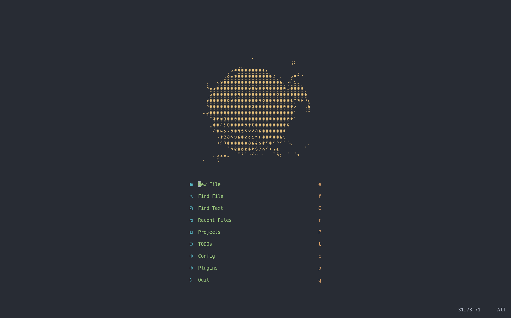

</details>

### Fuzzy finder

<details>
  <summary><b>Fuzzy Finder</b></summary>

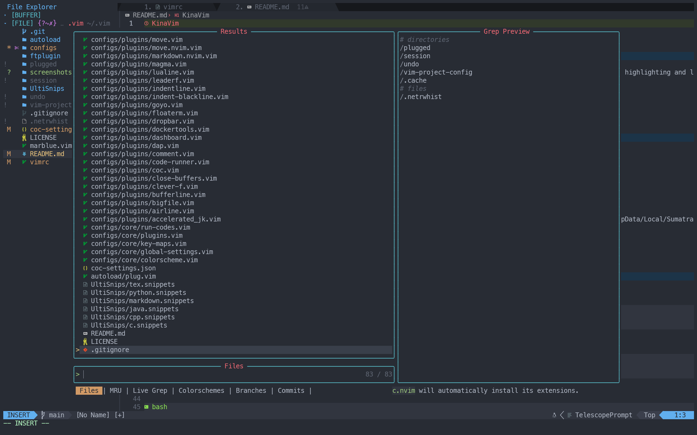

</details>

### ipython integration

<details>
  <summary><b>ipython</b></summary>

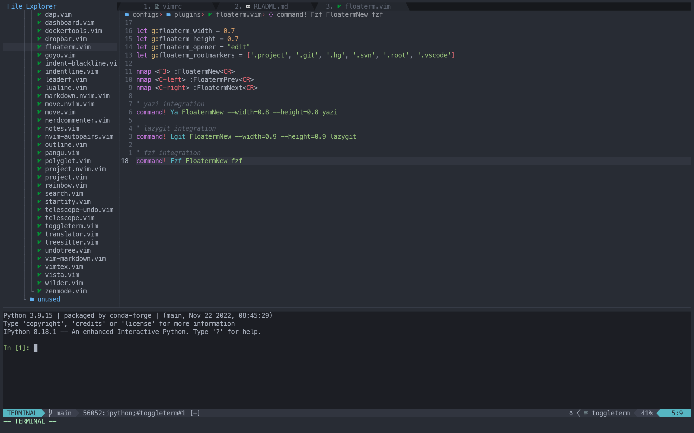

</details>

### Code space

<details>
  <summary><b>code space</b></summary>

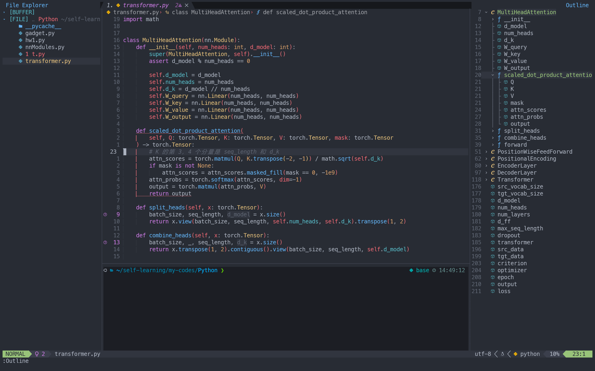

</details>

### Undo history

<details>
  <summary><b>Un Do</b></summary>

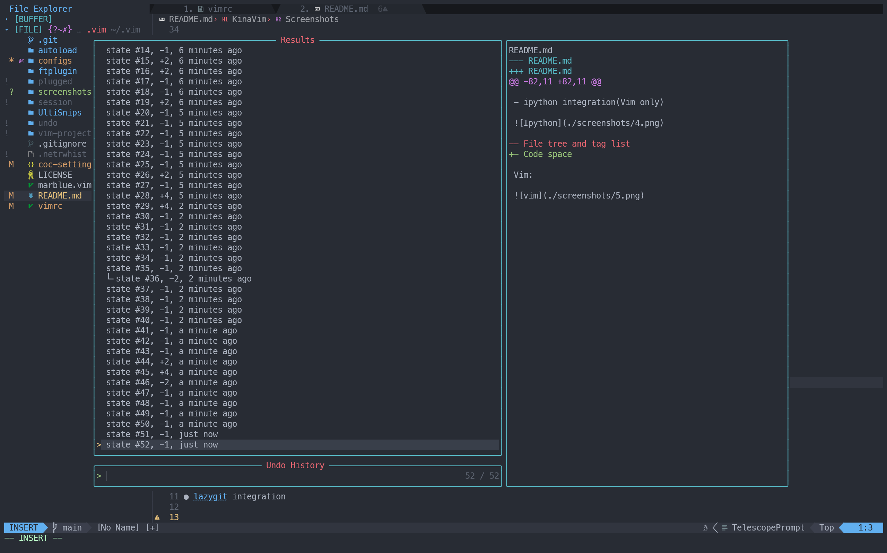

</details>

### [yazi](https://github.com/sxyazi/yazi) integration

<details>
  <summary><b>yazi</b></summary>

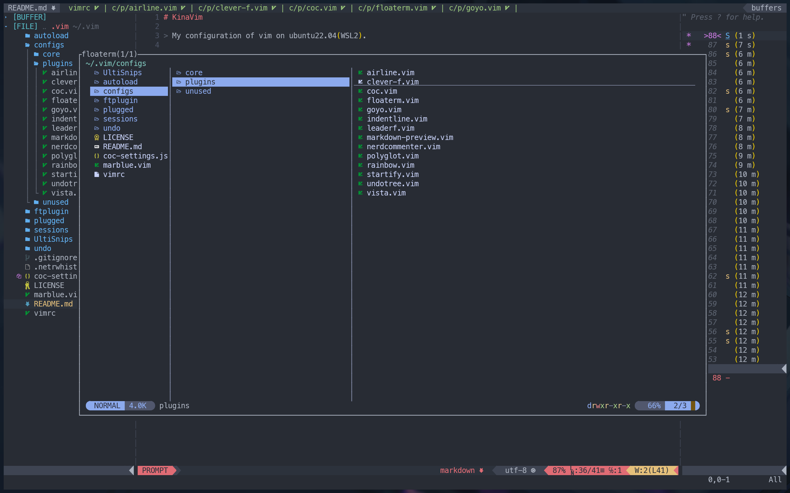

</details>

### Git information integration

<details>
  <summary><b>Git</b></summary>

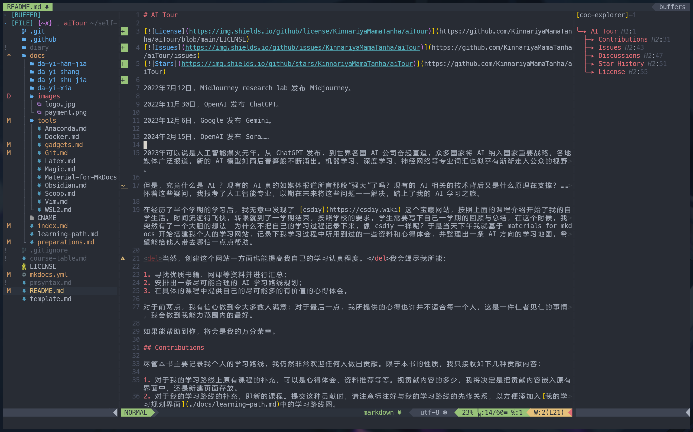

</details>

### [lazygit](https://github.com/jesseduffield/lazygit) integration

<details>
  <summary><b>lazygit</b></summary>

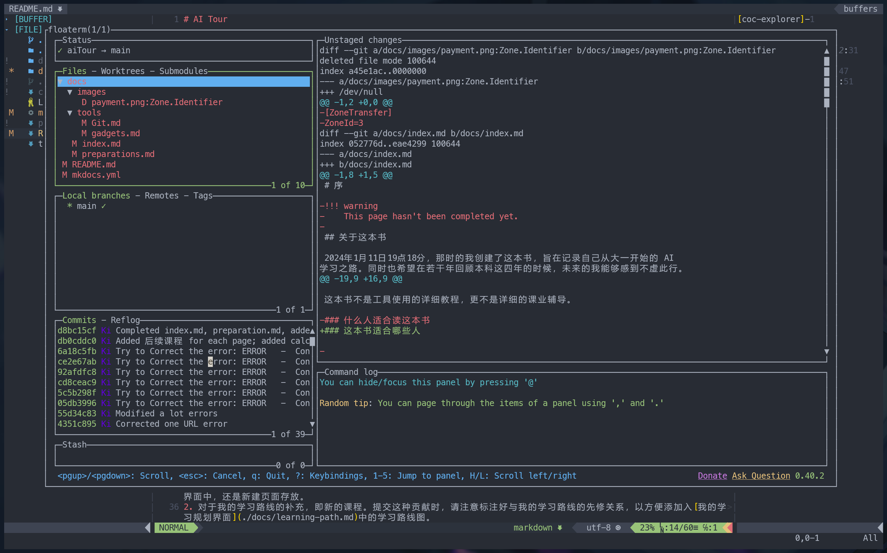

</details>

### Markdown preview

<details>
  <summary><b>Markdown preview</b></summary>

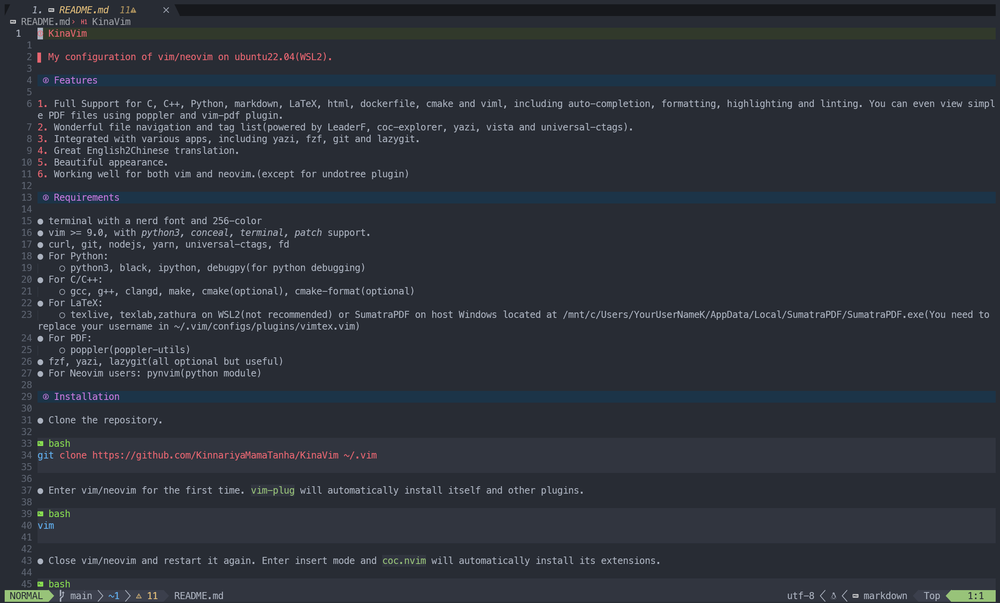

</details>

### Zen mode

<details>
  <summary><b>Zen Mode</b></summary>

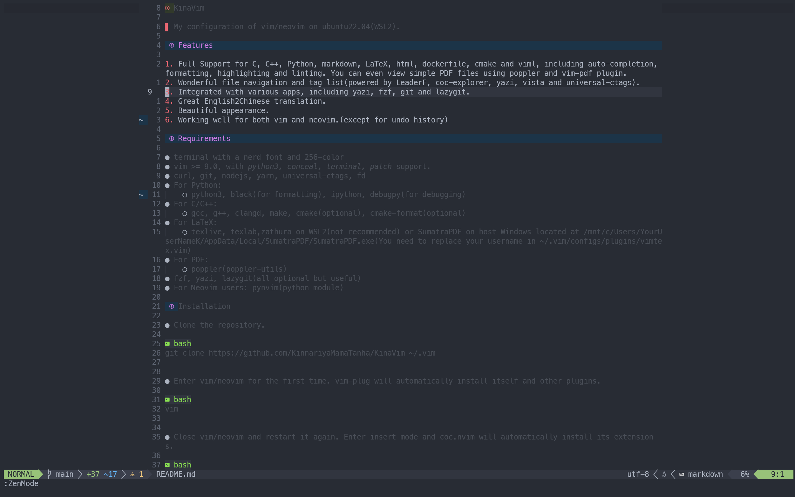

</details>

### Debugging

<details>
  <summary><b>Debugging</b></summary>

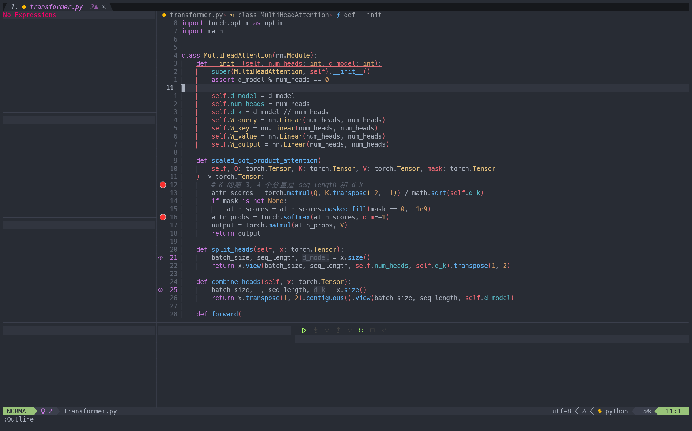

</details>
